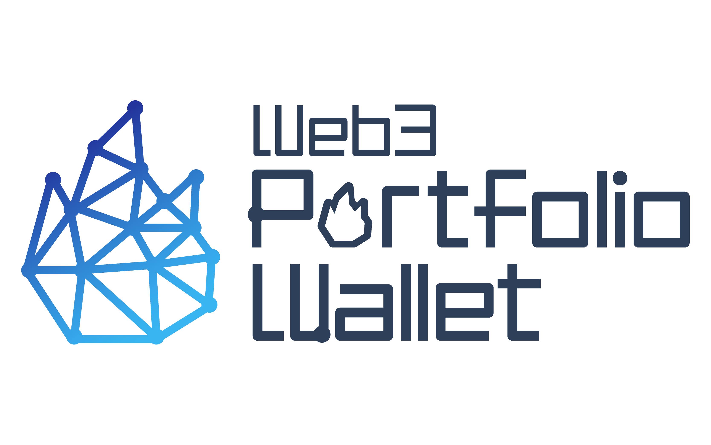
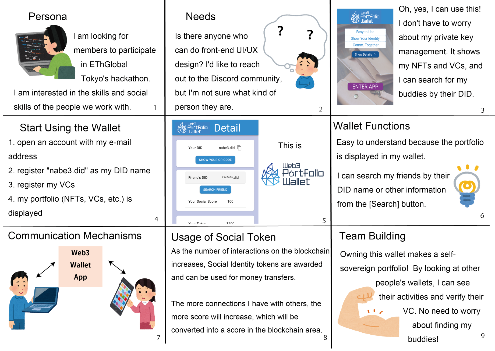

# Web3PortfolioWallet



## Concenpt



## Presentation Slides


## deployed Smartcontract

| No. | Name    | address                                                                                                                            |
| :-- | :------ | :--------------------------------------------------------------------------------------------------------------------------------- |
| 1   | DNS     | [0x8eD85ab44b29286D878492da06c862770A078176](https://testnet.snowtrace.io/address/0x8eD85ab44b29286D878492da06c862770A078176#code) |
| 2   | MyToken | [0xFF6E94b43b6c52f64eDb32926ad64a59039e8353](https://testnet.snowtrace.io/address/0xFF6E94b43b6c52f64eDb32926ad64a59039e8353#code) |

## SubGraph Endpoint

[https://api.studio.thegraph.com/query/44992/subgraph4/v0.0.2](https://api.studio.thegraph.com/query/44992/subgraph4/v0.0.2)

- Sample Query

```gql
query MyQuery {
  registereds(where: { to: "0x51908F598A5e0d8F1A3bAbFa6DF76F9704daD072" }) {
    did
    to
    name
  }
  tokenCreateds {
    symbol
    name
  }
  balanceChangeds(
    where: { to: "0x51908F598A5e0d8F1A3bAbFa6DF76F9704daD072" }
    first: 1
    orderDirection: desc
    orderBy: blockTimestamp
  ) {
    to
    balanceOf
  }
  updateVcs(where: { did: "did:ion:er....rer" }) {
    cid
    did
    name
  }
  updateScores(
    first: 1
    orderBy: blockTimestamp
    orderDirection: desc
    where: { to: "0x51908f598a5e0d8f1a3babfa6df76f9704dad072" }
  ) {
    to
    score
  }
}
```

## Wallet Address (private key is managed by AWS KMS)

[0xF1ed44b80FA7B1f2688aA69518EeaBC0A41523b5](https://testnet.snowtrace.io/address/0xF1ed44b80FA7B1f2688aA69518EeaBC0A41523b5)

## Commands

- install

```bash
yarn
```

- Smartcontract test

```bash
yarn test:contract
```

- deploy Smartcontract to Avalanche fuji Network

```bash
yarn deploy:fuji
```

- verify Smartcontract to Avalanche fuji Network

```bash
yarn verify:fuji
```

- start API Server

```bash
yarn start:api
```

- build frontend

```bash
yarn build:frontend
```

- start frontend

```bash
yarn start:frontend
```

- subgraph codegen

```bash
yarn subgraph:codegen
```

- subgraph build

```bash
yarn subgraph:build
```

- subgraph deploy

```bash
yarn subgraph:deploy
```

- kms connect test

```bash
yarn test:kms
```
